1. Buka laman resmi AWS https://aws.amazon.com/ 
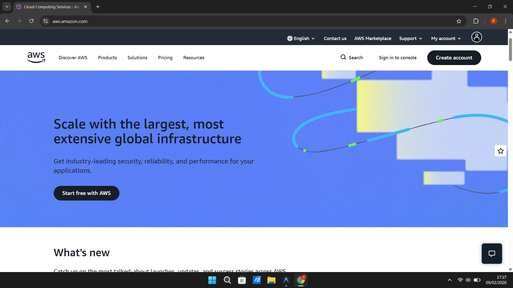

2. Pilih Menu Create Account
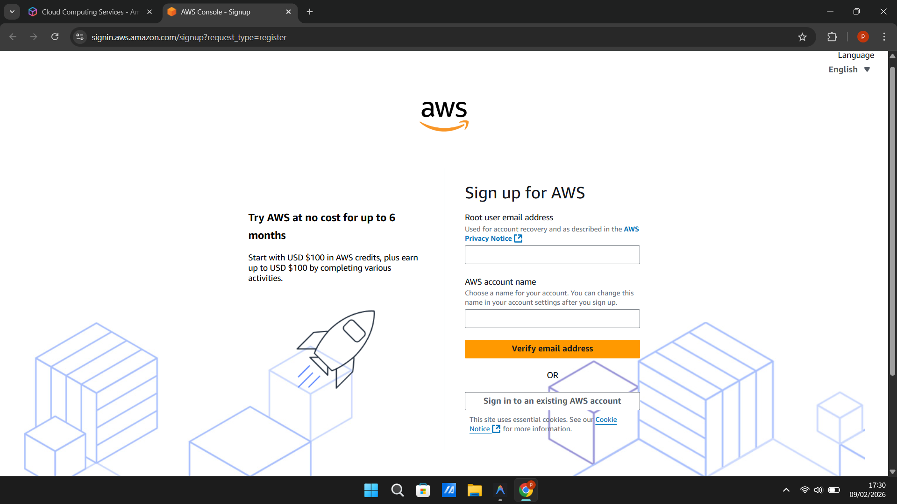

3. Isi email dan nama akun aws
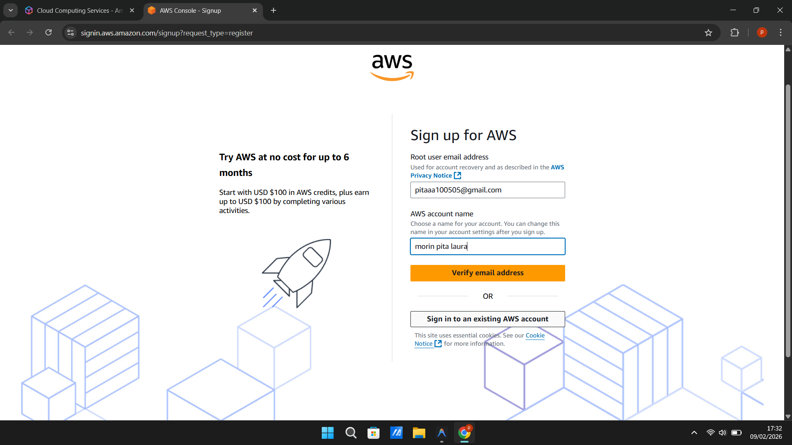

4. Verify email address
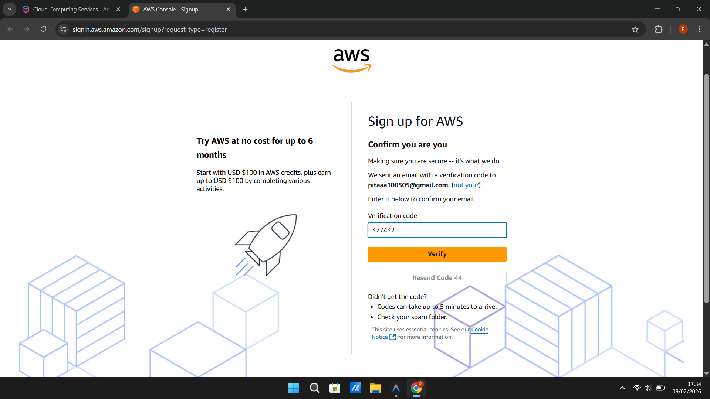 

5. Membuat Password
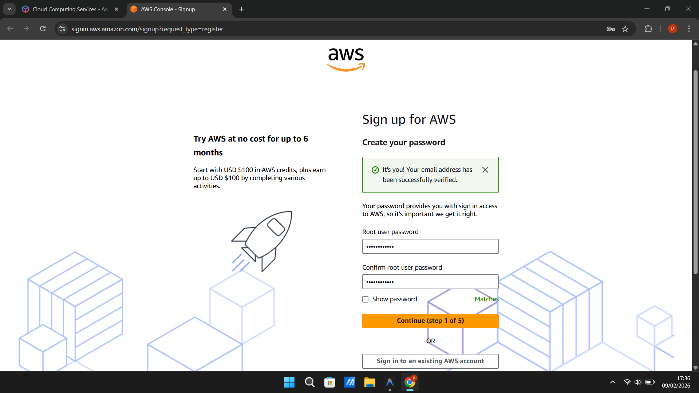

6. Pilih free tier
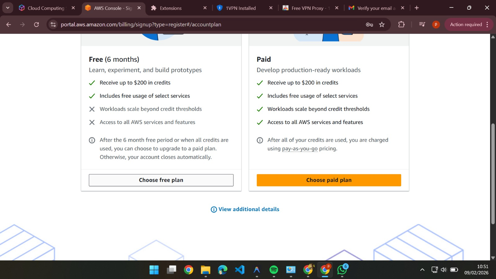

7. Mengisi kontak informasi
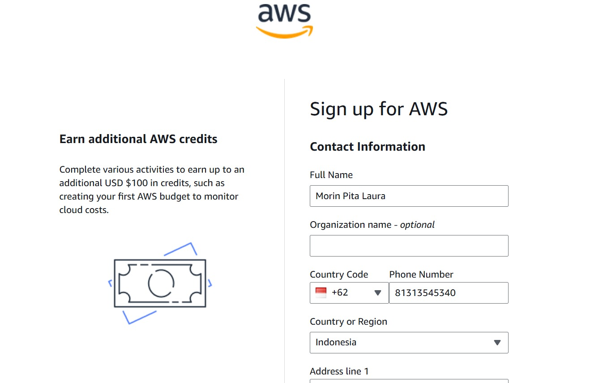

8. Billing Information
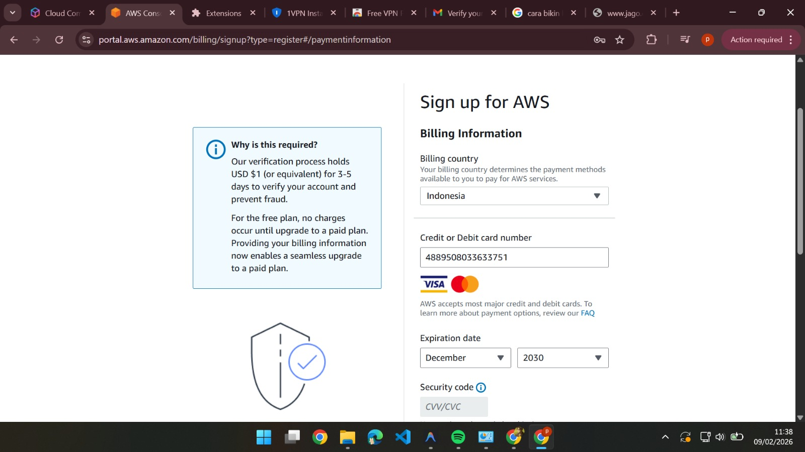

9. Konfirmasi Online Payment
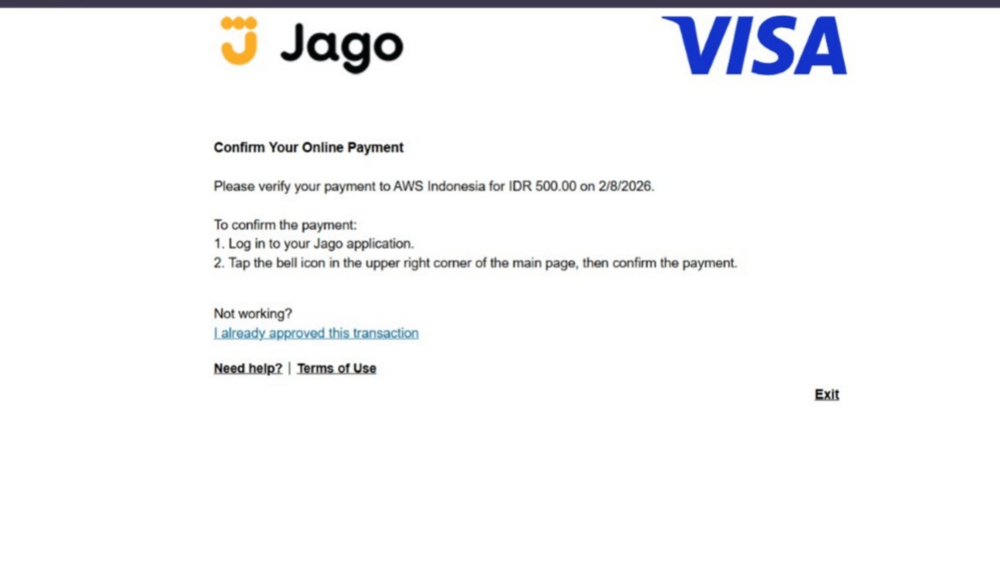

10. Konfirmasi Online Payment di Bank Jago
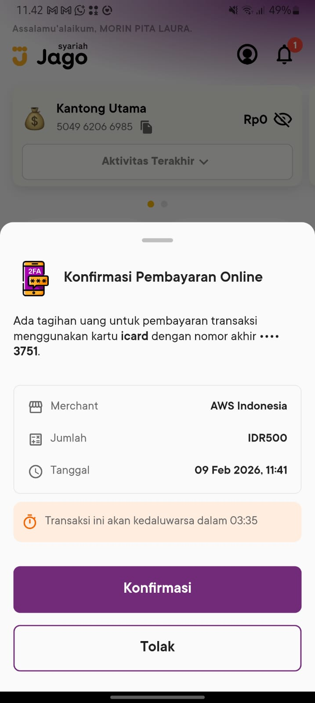

11. Konfirmasi step 3-5
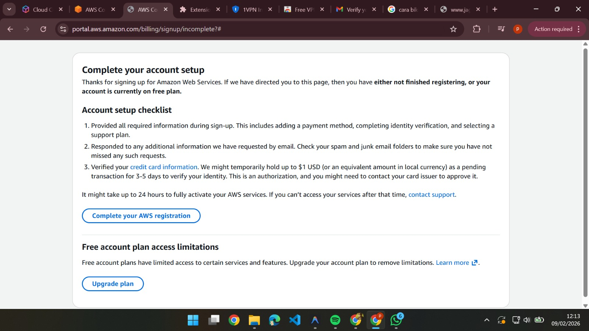

12. Masuk Saldo 100 Dollar
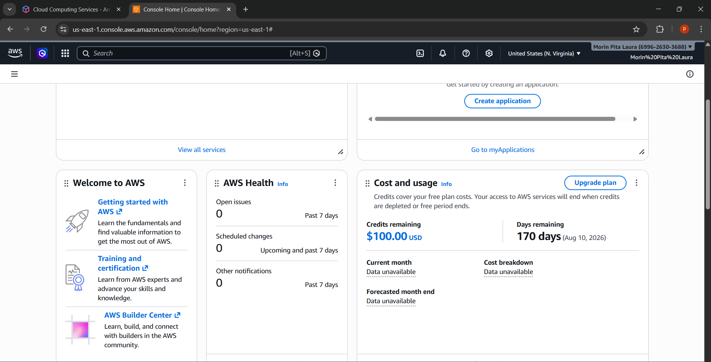