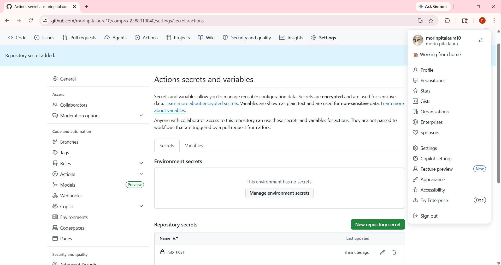
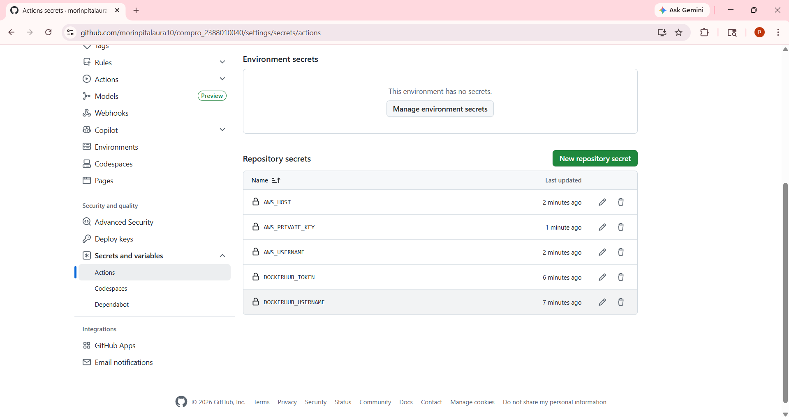
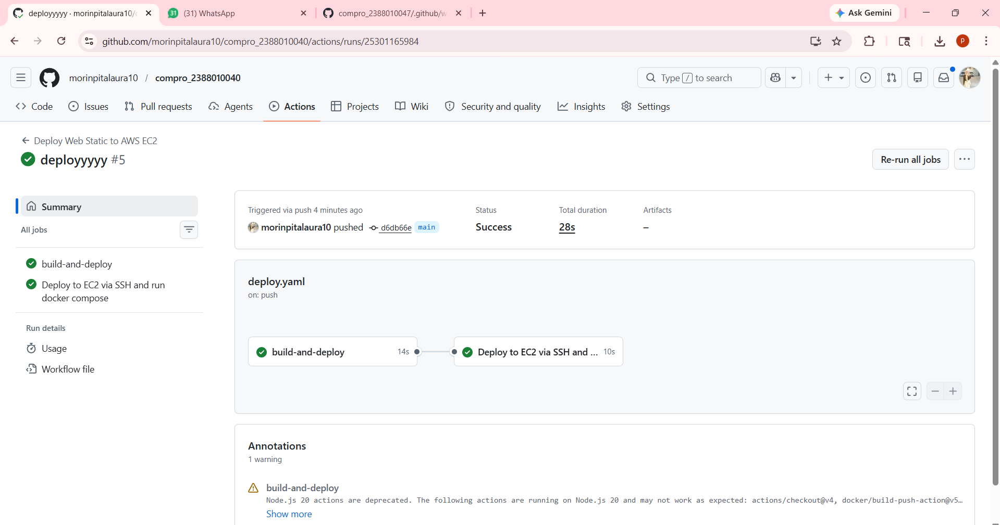

# Modernisasi CI/CD (Continuous Integration/Continuous Delivery)
# Lanjutan Praktikum Pertemuan 10

1. Mengisi Secrets Variable di Github Actions
    - Buka Repository di Github
    - Klik Settings -> Secrets and variables -> Actions

    - KLIK -> New repository secret
    - Name = DOCKERHUB_USERNAME
    - Value = Username akun dockerhub

    - KLIK -> New repository secret
    - Name = DOCKERHUB_TOKEN
    - Value = Token access docker hub

    - KLIK -> New repository secret
    - Name = AWS_HOST
    - Value = IP Address EC2

    - KLIK -> New repository secret
    - Name = AWS_USERNAME
    - Value = ubuntu

    - KLIK -> New repository secret
    - Name = AWS_PRIVATE_KEY
    - Value = [File Key) buka file .pem di notebook lalu ctrl+a ctrl+c

    
    

2. Melakukan edit file Pipeline di Github
    - Buka Projek compro_nim
    - Buat Folder Baru .github -> Buat folder workflows -> Buat File deploy.yaml
    - Isi file deploy.yaml sebagai berilkut :

    name: Deploy Next.js to AWS EC2
    on:
        push:
            branches: [ main ]

    jobs:
        build-and-deploy:
            runs-on: ubuntu-latest
            steps:
            - name: Checkout code
              uses: actions/checkout@v4

            - name: Login to Docker Hub
              uses: docker/login-action@v3
              with:
                username: ${{ secrets.DOCKERHUB_USERNAME }}
                password: ${{ secrets.DOCKERHUB_TOKEN}}

            - name: Build and push Docker image
              uses: docker/build-push-action@v5
              with:
                context: .
                push: true
                tags: ${{ secrets.DOCKERHUB_USERNAME }}/compro_2388010040:latest

            - name: Deploy to EC2 via SSH and run docker compose up -d
              uses: appleboy/ssh-action@1.0.3
              with:
                host: ${{ secrets.AWS_HOST }}
                username: ${{ secrets.AWS_USERNAME }}
                key: ${{ secrets.AWS_PRIVATE_KEY }}
                port: 22
                script: |
                docker rm -f compro_2388010040
                docker pull ${{ secrets.DOCKERHUB_USERNAME }}/compro_2388010040:latest
                docker run -d --name compro_2388010040 -p 80:80 ${{ secrets.DOCKERHUB_USERNAME }}/compro_2388010040:latest

3. Sebelum commit dan synch pada file
    - Pastikan sudah disable apache2 -> sudo systemctl disable apache2
    - Pastikan sudah stop apache2 -> sudo systemctl stop apache2
    - Pastikan user ubuntu sudah ditambahkan ->  sudo usermod -aG docker ubuntu
    - Baru lakukan Commit dan Push ke Github
    
    