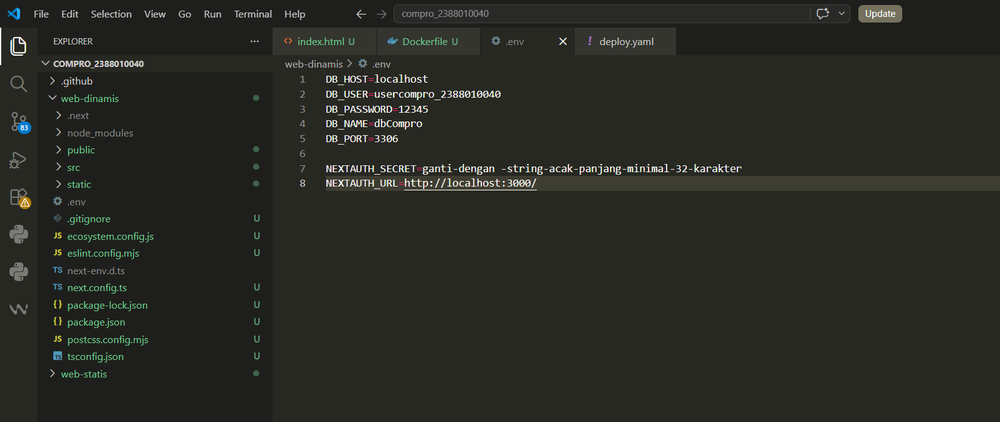
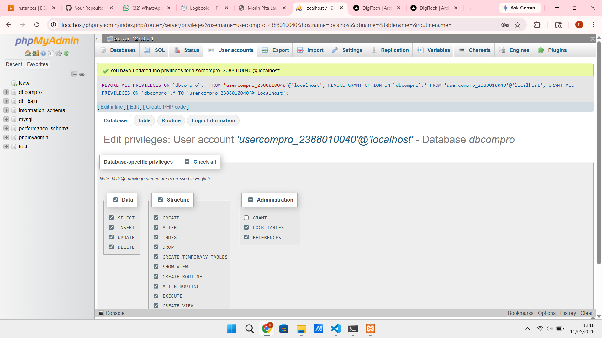
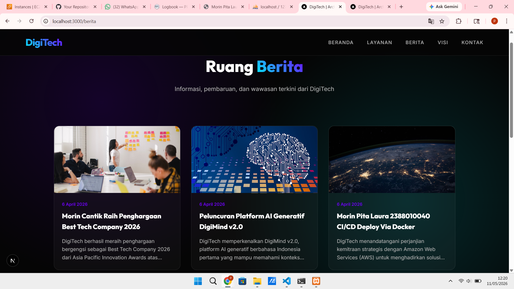

# Deploy Multi Apps CI/CD Docker

1. start Instance di AWS EC2
2. Patching OS -> sudo apt update && sudo apt upgrade
3. Hapus layanan nginx dan uninstall -> sudo systemctl stop nginx && sudo systemctl disable nginx
    sudo apt remove nginx nginx-common nginx-core
    sudo apt remove apache2
4. Hapus layanan Mariadb dan uninstall -> sudo systemctl stop mariadb && sudo systemctl disable mariadb
    sudo apt remove mariadb-server mariadb-client maria-db-common
5. Testing Next.JS + db menggunakan user bukan root di local environment
   - copy project digitech pada ptm6 kecuali folder .next, node_modules, sql, kedalam folder web-dinamis

    - create user baru bukan root di DBMS (xampp)

    
    - sesuaikan isi file .env
    - open terminal > cd web-dinamis
    - npm i
    - npm run dev 

