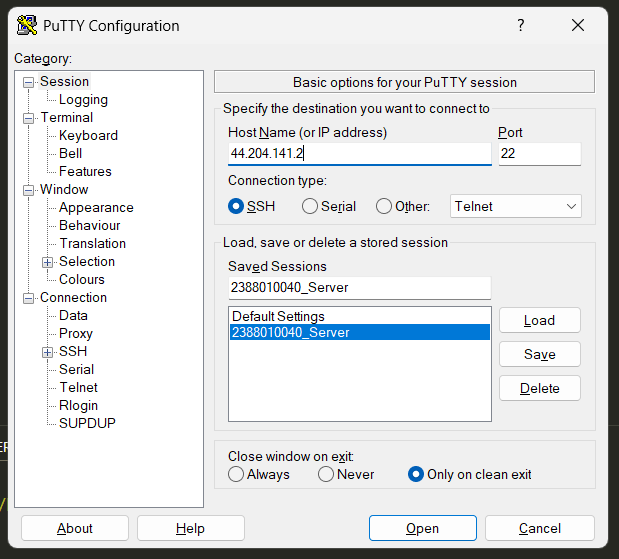
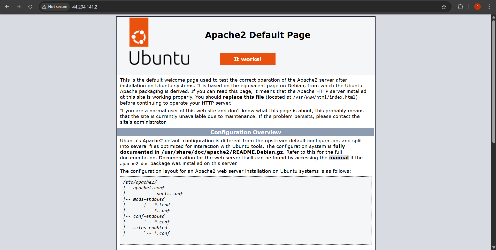
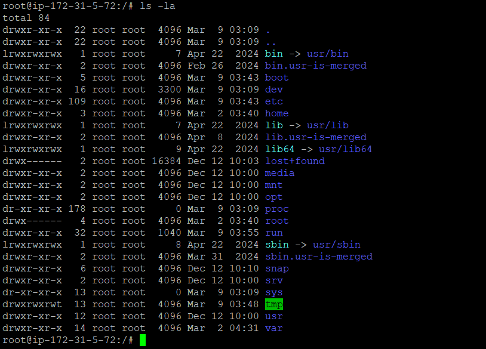
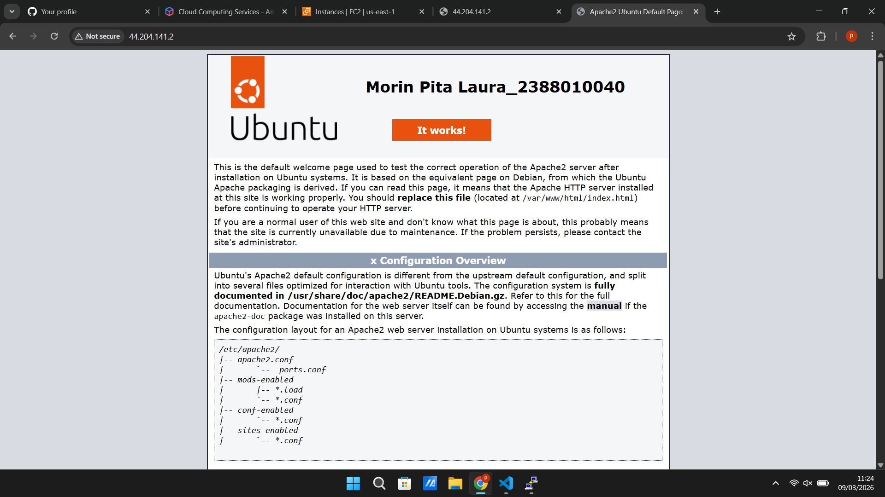

# Implementasi beberapa comand line interface linux ubuntu

1. Start Instance 
2. Buka putty
3. Kemudian load save session yang disimpan pada pertemuan 2

4. Update bagian IP address V4
    

5. sudo apt-get update untuk paching OS Linux server
6. cek web server kita (systemctl status apache2)
7. sudo systemctl stop apache2 (untuk berhentikan web server)

8. sudo systemctl start apache2 (untuk start ulang web server)
    

9. masukkan command ls -la (untuk melihat directory tempat cursor aktif)
10. masukkan sudo su (untuk masuk ke home)

11. masukkan cd ../.. untuk ke root folder
    

12. masuk ke folder var (cd var/www/html)
13. masukkan nano index.html (untuk custom nama dan nim)
    
