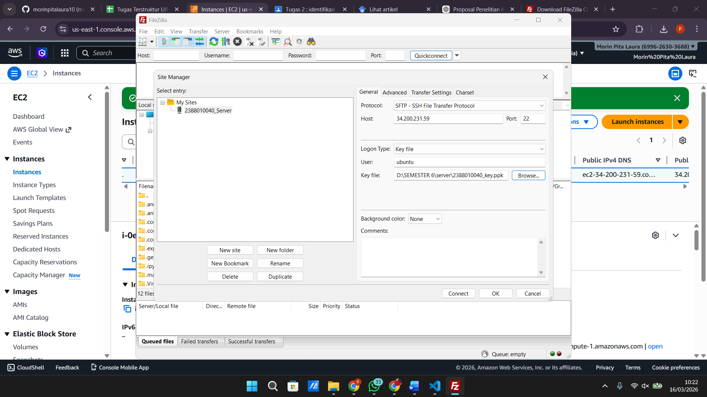
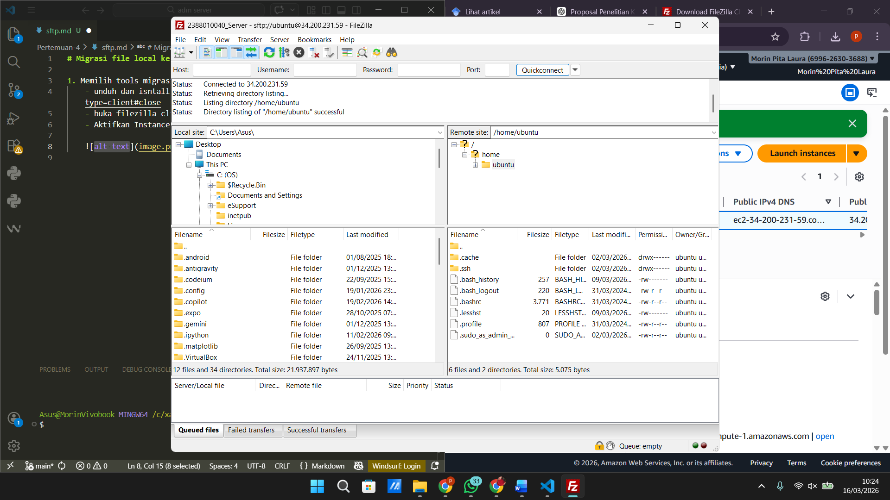
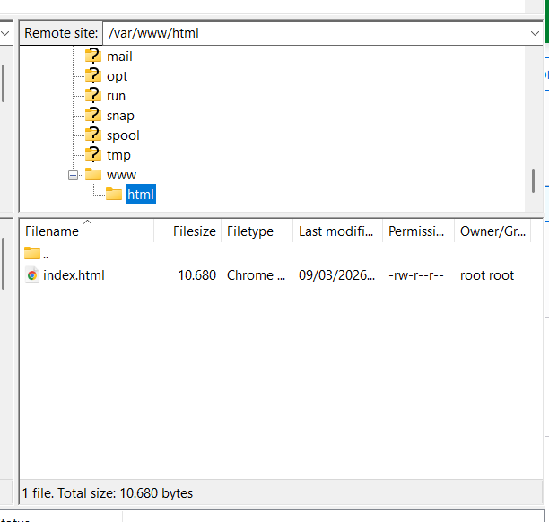
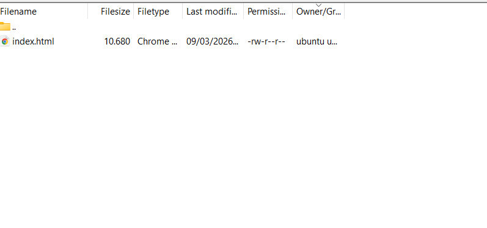
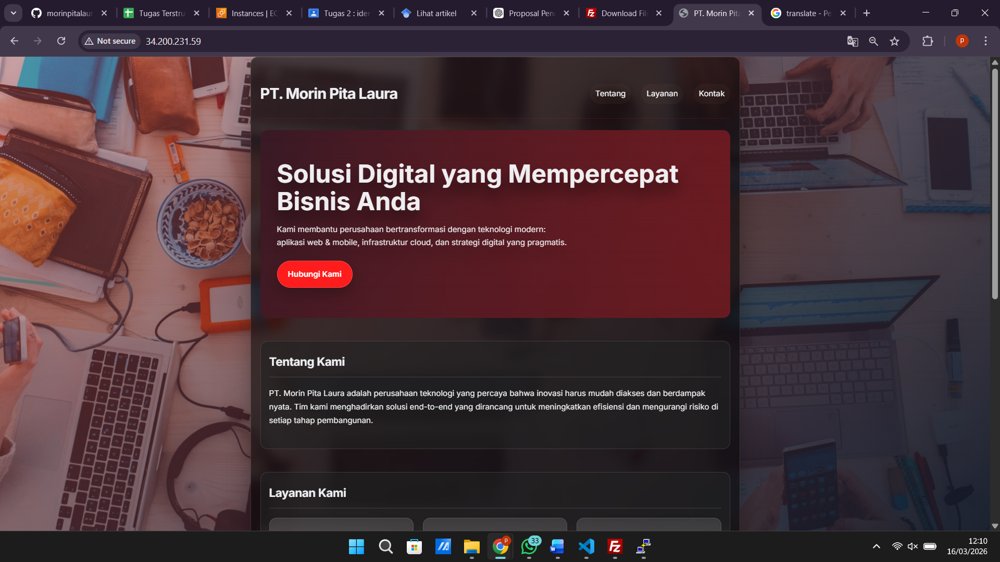

# Migrasi file local ke cloud server(AWS EC2)

1. Memilih tools migrasi file misal kita akan gunakan Filezilla
    - Unduh dan isntall di https://filezilla-project.org/download.php?type=client#close
    - Buka filezilla client
    - Aktifkan Instance di AWS
    - Kembali ke Filezilla Client
    - Klik File > Site Manager
    - Klik New Site
    - Protocol > SFTP
    - Host > IP Publik EC2
    - Port > 22
    - Logon Type > Key file
    - User > ubuntu
    - Key file > Pilih file .ppk/ .pem yang didownload saat membuat instance
    - Klik Ok
    - CTRL + S
    - Klik Connect

    

2. Pada Dashboard utama filezilla akan terbagi menjadi 2 panel
    - Panel Kiri > File Local (Komputer Anda)
    - Panel Kanan > File server (AWS EC2)
    

3. Arahkan directory Cloud (Panel Kanan) ke Folder web server services area
    - /var/www/html
    

4. Untuk solusi Permission Denied pada folder /var/www/html
    - Ubah kepemilikan folder
    - Mengubah folder /var/www/html agar bisa diakses oleh user 'ubuntu'
    - Sintaks: sudo chown -R ubuntu:ubuntu /var/www/html
    

5. Edit file index.html menjadi company profile
    

