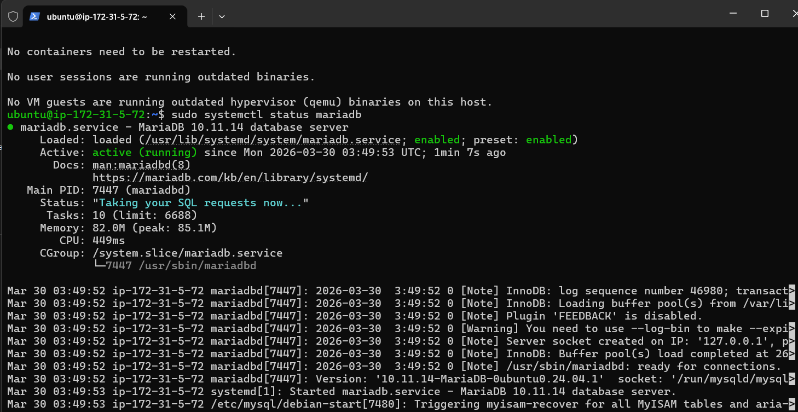
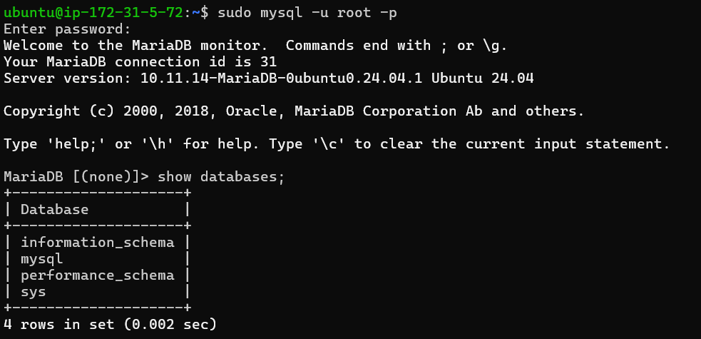
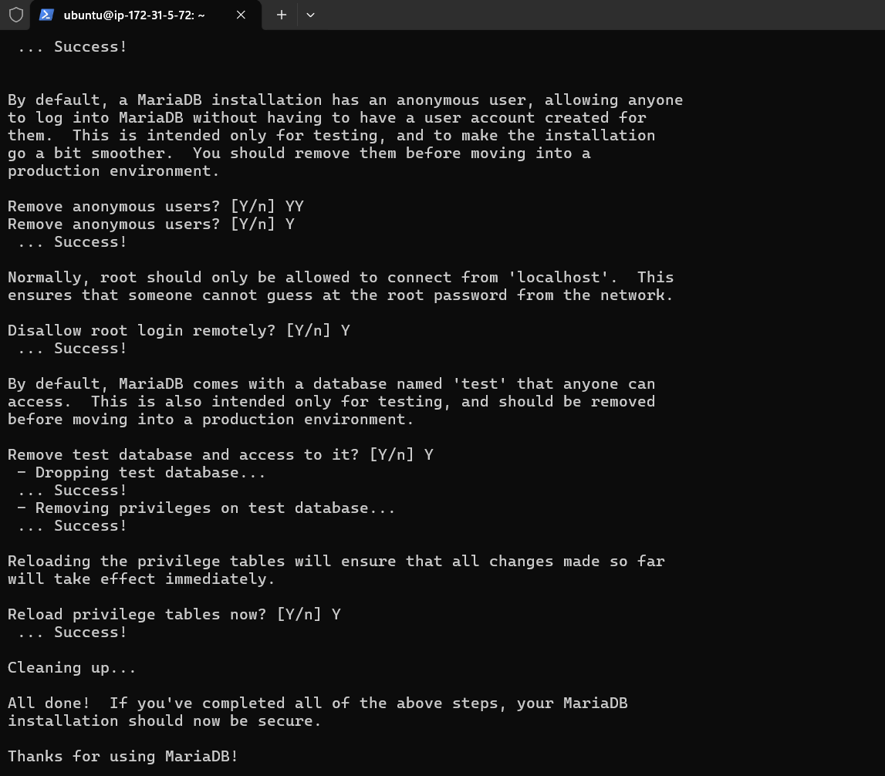
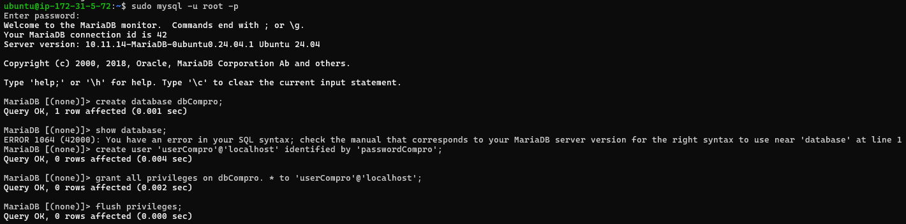
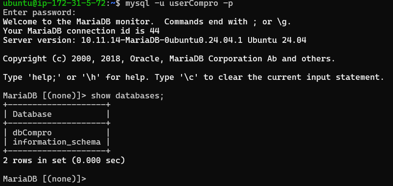

# Membuat Database MySQL di AWS EC2

1. Aktifkan Instance di EC2
2. Remote SSH Via Terminal
    - Masuk ke folder penyimpanan Private Key kita
    - Masukkan command (ssh -i namafile.pem ubuntu @[IP_ADDRESS])
    - Tekan Enter

3. Lakukan Patching OS
    - sudo apt-get update && sudo apt-get upgrade

4. Kita akan install MariaDb
    - sudo apt-get install mariadb-server
    - sudo systemctl status mariadb
    - coba apakah default setting yg berlaku (sudo mysql -u root -p)
    - cek apakah masih ada database dummy (show databases;)
    
    

5. Kita lakukan hardening security
    - masukkan command (sudo mysql_secure_installation)
    - masukkan password db aws sever : Admin123@#
    - remove anonymous users (Y)
    - dissallow root login remotely (Y)
    - Remove test database and access to it (Y)
    - Reload privilege tables now? (Y)
    

6. Membuat database dan user
    - membuat database untuk web company profile  (create database dbCompro)
    - membuat user untuk web company profile (create user 'userCompro'@'localhost' identified by '***;)
    - memberikan hak akses user untuk web company profile (grant all privileges on dbCompro. * to 'userCompro'@'localhost';)
    - Flush Privilege (flush privileges;)
    - keluar dari MySQL (exit;)
    

7. login sebagai user baru
    - masukkan command (mysql -u userCompro -p)
    - masukkan password (***)
    - cek apakah password 
    