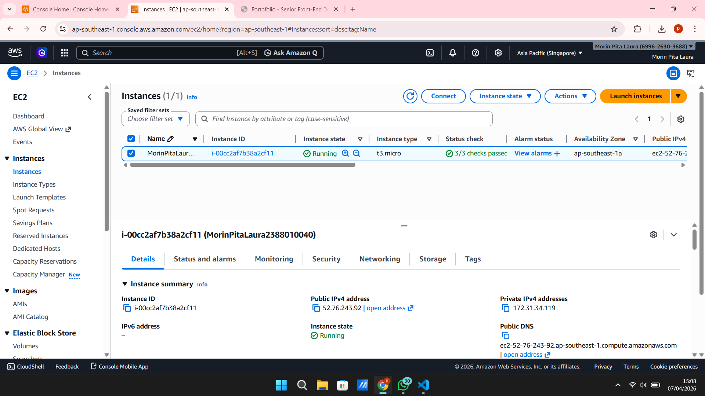
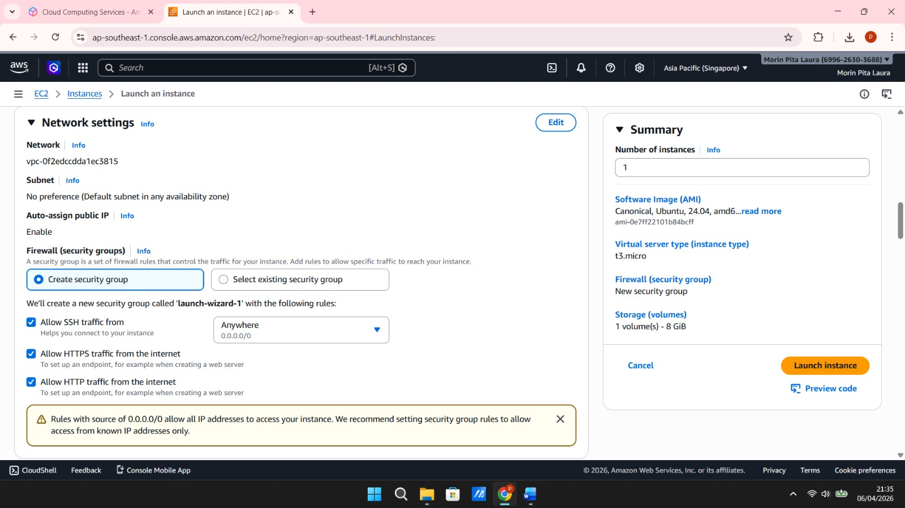
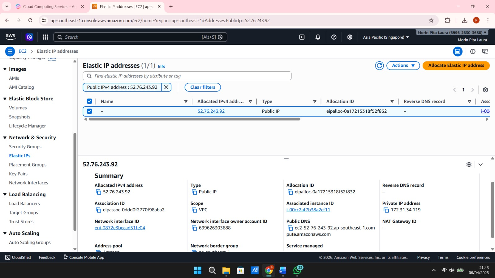
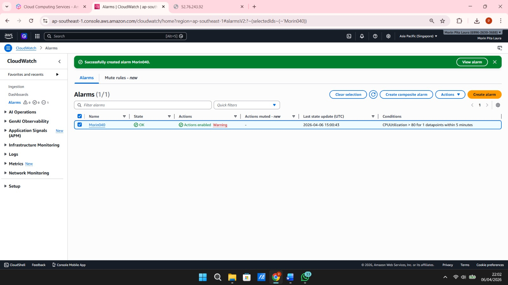
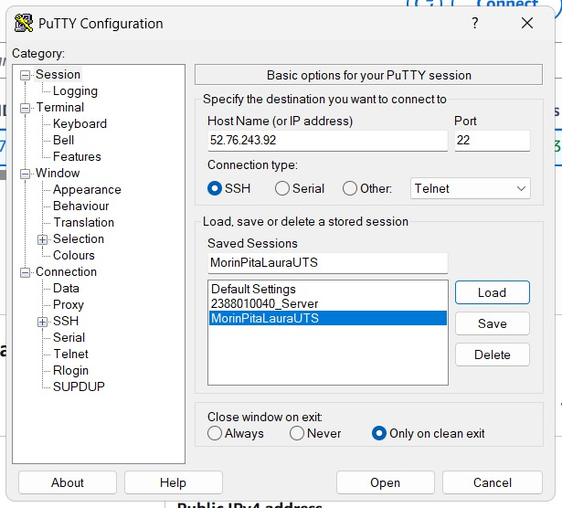
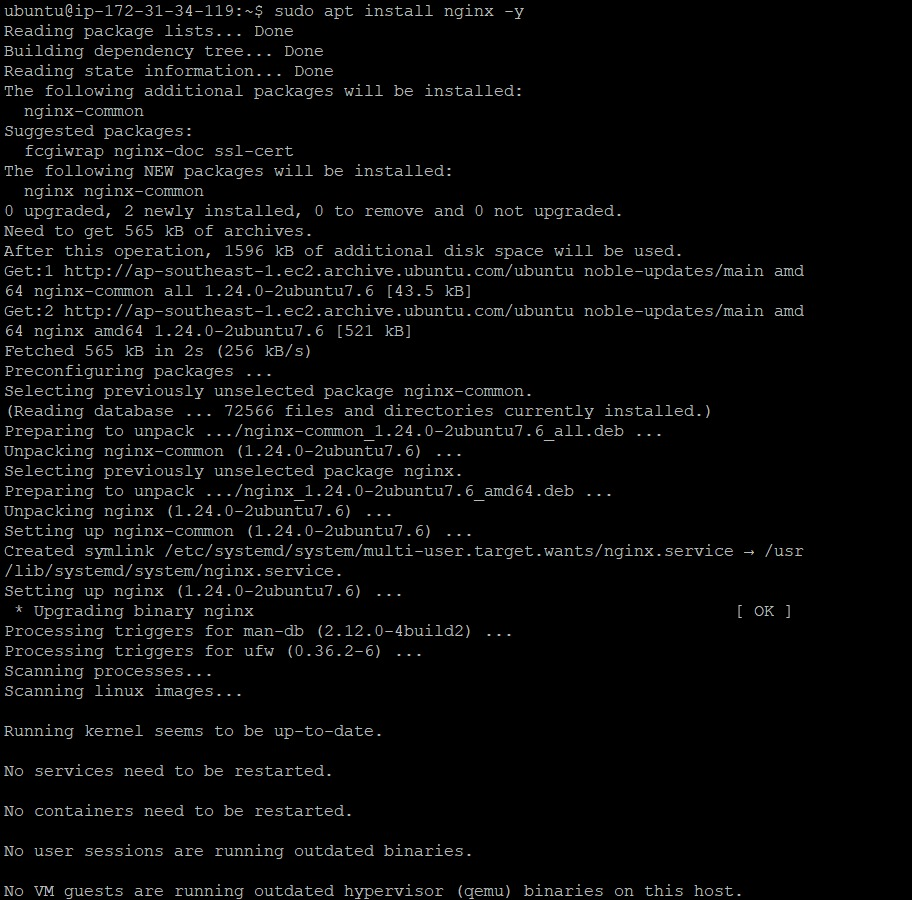
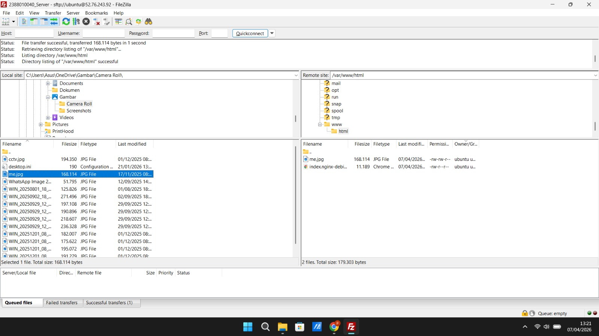
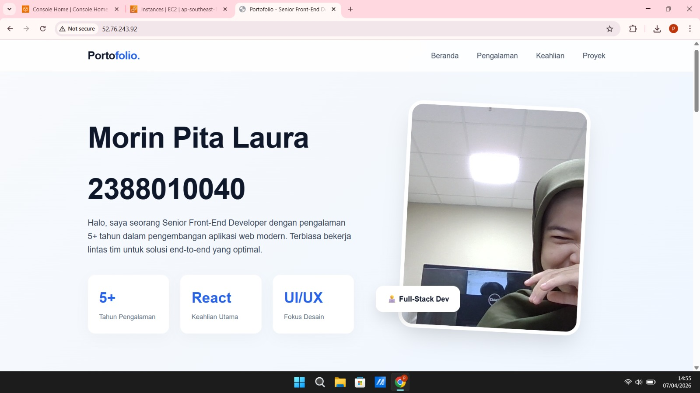

# UTS Adminstrasi Server
## Morin Pita Laura
## 2388010040
## Informatika 6B

### 1. Membuat Instance

### 2. Mengatur security group

### 3. Membuat Elastic IP

### 4. Membuat Alarm Clouwatch CPU 80%>

### 5. Remote SSH

### 6. Install Web server (Nginx Server)

### 7. Set up File Zilla

### 8. Website Curicullum Vitae
